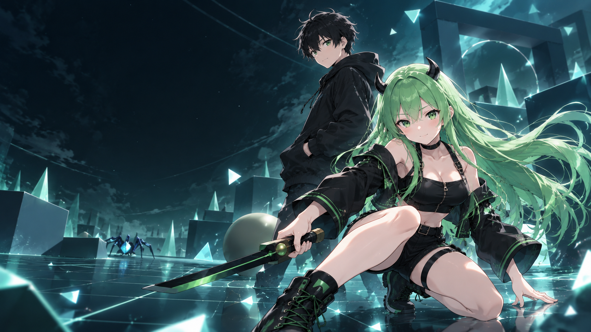
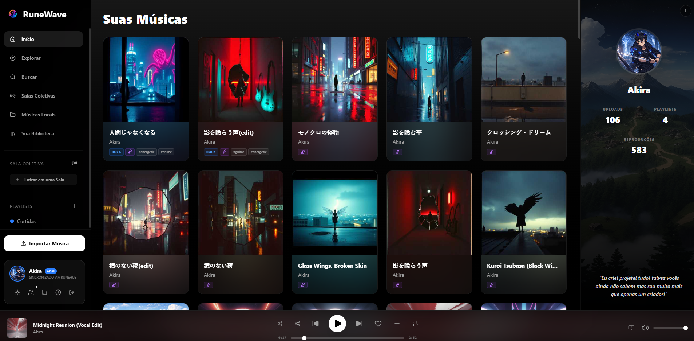
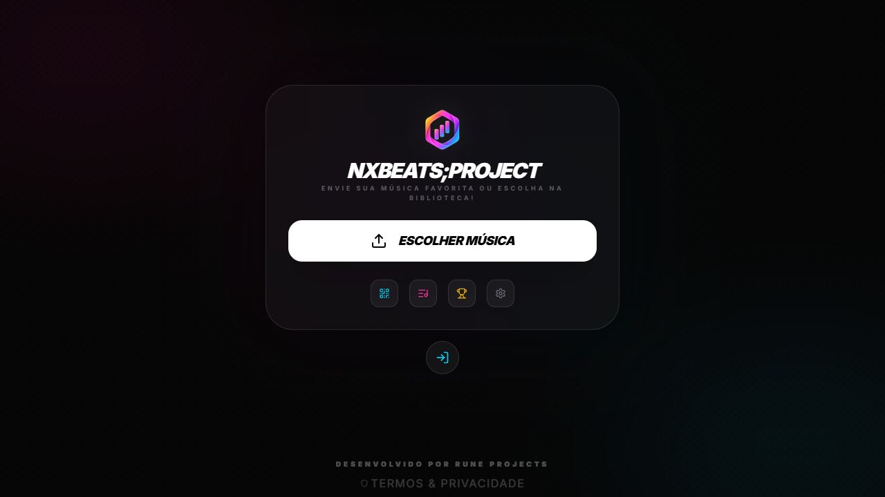
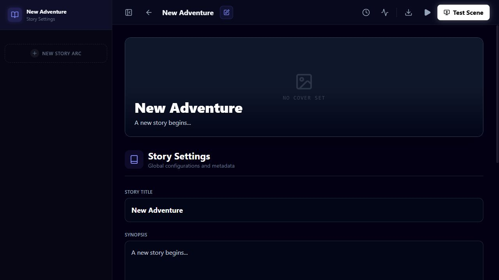

<h1 align="center">Guilherme Dill</h1>

  <strong>Infrastructure by profession. Products, games & AI by curiosity.</strong> 
  Creator of <a href="https://www.runeprojects.com.br">Rune Projects</a>

I'm an IT professional with **10+ years of experience** in infrastructure, security and automation. I build tools that connect reliable systems with thoughtful interfaces — from corporate operations to desktop apps and local AI.

Through **Rune Projects**, I create an ecosystem of software, games, music and storytelling. **Nixie** is the original character connecting that universe; my work includes both the experiences people use and the tools behind their creation.

<h2 align="center">Inside the RUNE universe</h2>

<table>
  <tr>
    <td width="50%" align="center">
      
      <h3>Nixie · Crystal Garden</h3>
      
An original universe brought into a 3D browser game.

      <a href="https://nixiegame.runeprojects.com.br/">Play</a> ·
      <a href="https://www.runeprojects.com.br/nixie">Explore the universe</a>
    </td>
    <td width="50%" align="center">
      
      <h3>RuneWave</h3>
      
Music libraries, local playback & shared listening rooms.

      <a href="https://runewave.runeprojects.com.br/">Explore the platform</a>
    </td>
  </tr>
  <tr>
    <td width="50%" align="center">
      
      <h3>NxBeats;Project</h3>
      
Audio analysis, rhythm gameplay & dynamic difficulty.

      <a href="https://nxbeats-project.up.railway.app/">Explore the game</a>
    </td>
    <td width="50%" align="center">
      
      <h3>Rune Story Studio</h3>
      
A studio for stories, scenes & interactive narratives.

      <a href="https://runestorystudio.runeprojects.com.br/">Open the studio</a>
    </td>
  </tr>
</table>

Crystal Garden: official artwork · RuneWave: published product screenshot · NxBeats: public start screen · Story Studio: fresh demo project.

The lab goes further: **NixieOS**, financial tools with **FinanFlow**, connected identity through **RuneHub**, and infrastructure projects such as **Linkys, Zabbix Vision Pro, SharkAI and InfraGuard Manager**. Some source repositories remain private; their work is presented in the portfolio.

  <a href="https://www.runeprojects.com.br"><strong>Explore all projects →</strong></a> 
  <a href="https://www.runeprojects.com.br/nixie">Nixie's universe</a> ·
  <a href="https://runehub.runeprojects.com.br/">RuneHub</a> ·
  <a href="https://finanflow2026.runeprojects.com.br/">FinanFlow</a>

  <a href="https://github.com/guilhermealceu/AuraDock---Menu-Lateral-Inteligente">AuraDock</a> ·
  <a href="https://github.com/guilhermealceu/RuneScan-Network">RuneScan Network</a> ·
  <a href="https://github.com/guilhermealceu/Root-Terminator">Root Terminator</a> 
  <a href="https://github.com/guilhermealceu/steins-tracker">Steins;Tracker</a> ·
  <a href="https://github.com/guilhermealceu/steins-arcade">Steins;Arcade</a> ·
  <a href="https://github.com/guilhermealceu/pfsense-scripts">pfSense Scripts</a> ·
  <a href="https://linkedin.com/in/guilhermealceu">LinkedIn</a>

<h2 align="center">Technologies & tools</h2>

  
  
  
  
  
  
  

  
  
  
  
  
  

Windows Server · Microsoft 365 · Google Workspace · Fortinet · Sophos · Hyper-V · GLPI REST APIs · WebSockets · Stable Diffusion · LoRA · Whisper · TTS · OpenCV · VRM

